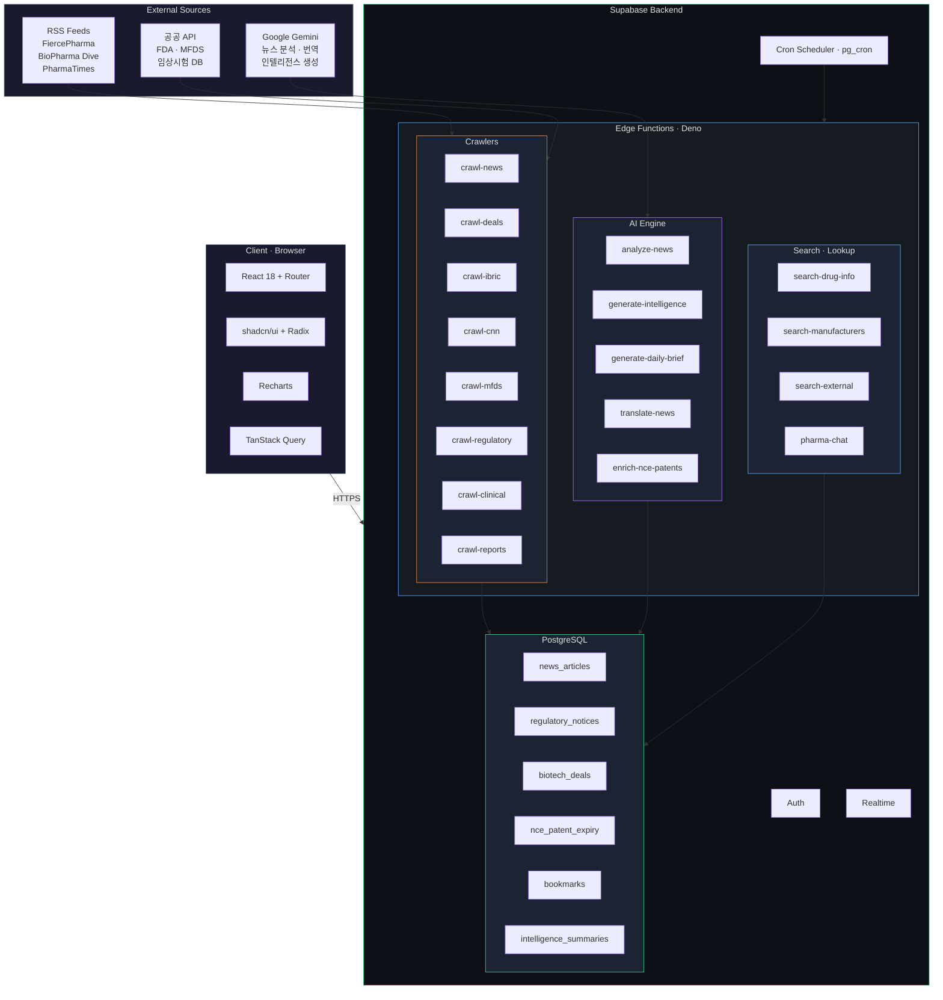
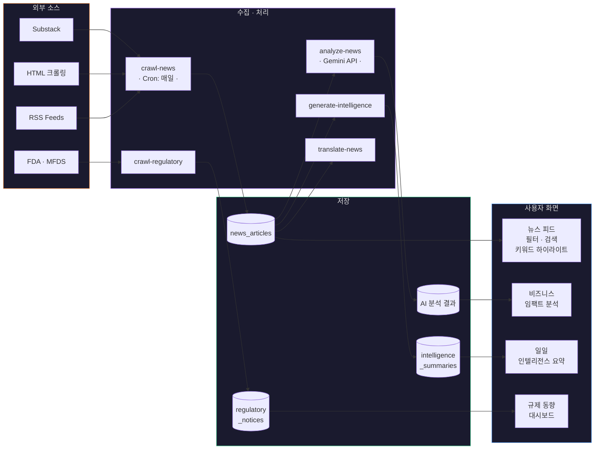
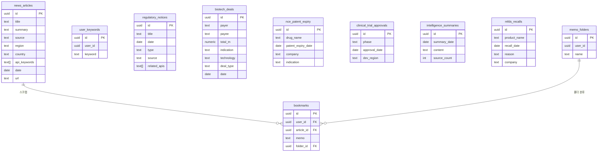

<p align="center">
  
  
  
  
  
</p>

<h1 align="center">💊 AceBioNews</h1>

<p align="center">
  <b>바이오·제약 산업 뉴스 통합 인텔리전스 플랫폼</b><br/>
  국내외 제약·바이오 뉴스, 규제 동향, 특허 만료, 임상시험, 빅딜 정보를 <br/>
  실시간으로 수집·분석·요약하여 한눈에 제공합니다.
</p>

<p align="center">
  <a href="#-주요-기능">주요 기능</a> •
  <a href="#%EF%B8%8F-시스템-아키텍처">아키텍처</a> •
  <a href="#-기술-스택">기술 스택</a> •
  <a href="#-시작하기">시작하기</a> •
  <a href="#-프로젝트-구조">프로젝트 구조</a> •
  <a href="#-데이터-파이프라인">데이터 파이프라인</a>
</p>

---

##  주요 기능

| 기능 | 설명 |
|:---|:---|
|  **뉴스 자동 수집** | 국내(데일리팜, 약사공론, 의약뉴스 등) / 해외(FiercePharma, BioPharma Dive 등) 13개+ 소스에서 RSS·크롤링 기반 자동 수집 |
|  **AI 뉴스 분석** | Google Gemini 기반 원료의약품(API) 산업 관점의 비즈니스 임팩트 자동 분석 |
|  **인텔리전스 요약** | 일일 브리핑 및 산업 인텔리전스 자동 생성 |
|  **의약품 검색** | 약물 정보 검색 및 제조사 정보 조회 |
|  **규제 동향** | FDA 승인, MFDS(식약처) 고시, 임상시험 IND 승인, 리콜 정보 통합 |
|  **NCE 특허 만료** | 신규화합물(NCE) 특허 만료 일정 추적 및 알림 |
|  **바이오 빅딜** | 글로벌 바이오텍 라이선스 딜·M&A 정보 모니터링 |
|  **스크랩 & 메모** | 기사 북마크, 메모 작성, 폴더 관리 |
|  **키워드 알림** | 사용자 관심 키워드 등록 및 매칭 뉴스 하이라이트 |
|  **다국어 번역** | 해외 뉴스 한국어 자동 번역 |

---

## 🏗️ 시스템 아키텍처



---

## 📡 데이터 파이프라인



---

## 🛠 기술 스택

### Frontend

| 기술 | 용도 |
|:---|:---|
| **React 18** | UI 렌더링 (SPA) |
| **TypeScript 5.8** | 타입 안전성 |
| **Vite 5** | 빌드 도구 & 개발 서버 |
| **TailwindCSS 3** | 유틸리티 기반 스타일링 |
| **shadcn/ui + Radix** | 접근성 준수 UI 컴포넌트 |
| **TanStack Query** | 서버 상태 관리 & 캐싱 |
| **React Router 6** | 클라이언트 라우팅 |
| **Recharts** | 데이터 시각화 차트 |
| **React Markdown** | 마크다운 렌더링 |

### Backend

| 기술 | 용도 |
|:---|:---|
| **Supabase** | BaaS (DB + Auth + Edge Functions + Realtime) |
| **PostgreSQL** | 관계형 데이터베이스 |
| **Deno (Edge Functions)** | 서버리스 함수 (크롤링, AI 분석, 검색) |
| **Google Gemini API** | 뉴스 분석 및 인텔리전스 생성 |
| **pg_cron** | 데이터 수집 자동 스케줄링 |

---

## 시작하기

### 사전 요구사항

- **Node.js** >= 18 (또는 **Bun** 런타임)
- **npm** 또는 **bun**
- Supabase 프로젝트 (환경 변수 필요)

### 설치 및 실행

```bash
# 1. 저장소 클론
git clone https://github.com/your-username/acebionews.git
cd acebionews

# 2. 의존성 설치
npm install
# 또는
bun install

# 3. 환경 변수 설정
cp .env.example .env
# .env 파일에 Supabase 정보 입력
```

### 환경 변수

```env
VITE_SUPABASE_URL=https://your-project.supabase.co
VITE_SUPABASE_PUBLISHABLE_KEY=your-anon-key
VITE_SUPABASE_PROJECT_ID=your-project-id
```

### 개발 서버 실행

```bash
npm run dev     # http://localhost:5173
```

### 빌드

```bash
npm run build        # 프로덕션 빌드
npm run build:dev    # 개발 모드 빌드
npm run preview      # 빌드 결과 미리보기
```

### 테스트

```bash
npm run test         # 테스트 실행
npm run test:watch   # 워치 모드
```

---

## 📁 프로젝트 구조

```
acebionews/
├── public/                          # 정적 파일
├── src/
│   ├── components/                  # UI 컴포넌트
│   │   ├── ui/                      #   shadcn/ui 기본 컴포넌트
│   │   ├── AppHeader.tsx            #   상단 헤더 (로그인, 필터)
│   │   ├── NewsList.tsx             #   뉴스 목록 메인 뷰
│   │   ├── Sidebar.tsx              #   사이드바 (인텔리전스, 약물검색, 빅딜)
│   │   ├── FdaSection.tsx           #   FDA 규제 정보
│   │   ├── MfdsSection.tsx          #   식약처(MFDS) 정보
│   │   ├── NcePatentSection.tsx     #   NCE 특허 만료
│   │   ├── BigDealsSection.tsx      #   바이오 빅딜
│   │   ├── DrugSearchSection.tsx    #   의약품 검색
│   │   ├── KeywordAlertSection.tsx  #   키워드 알림
│   │   └── ...
│   ├── hooks/                       # 커스텀 React Hooks
│   │   ├── useNewsData.ts           #   뉴스 데이터 페칭
│   │   ├── useNewsFilters.ts        #   필터링 로직
│   │   ├── useAuth.ts               #   인증 상태 관리
│   │   ├── useBookmarks.ts          #   북마크 관리
│   │   └── useUserKeywords.ts       #   키워드 관리
│   ├── integrations/
│   │   └── supabase/                # Supabase 클라이언트 & 타입
│   ├── data/                        # Mock 데이터
│   ├── pages/                       # 페이지 컴포넌트
│   └── utils/                       # 유틸리티 함수
│
├── supabase/
│   ├── functions/                   # Edge Functions (22개)
│   │   ├── crawl-news/              #   뉴스 크롤링 (RSS + HTML)
│   │   ├── crawl-deals/             #   바이오 딜 정보 수집
│   │   ├── crawl-clinical-trials/   #   임상시험 데이터
│   │   ├── crawl-regulatory/        #   규제 공시 수집
│   │   ├── crawl-mfds-recalls/      #   식약처 리콜 정보
│   │   ├── analyze-news/            #   AI 뉴스 분석 (Gemini)
│   │   ├── generate-intelligence/   #   인텔리전스 리포트
│   │   ├── generate-daily-briefing/ #   일일 브리핑
│   │   ├── translate-news/          #   뉴스 번역
│   │   ├── search-drug-info/        #   약물 정보 검색
│   │   ├── pharma-chat/             #   AI 챗봇
│   │   └── ...
│   └── migrations/                  # DB 마이그레이션 파일
│
├── package.json
├── vite.config.ts
├── tailwind.config.ts
└── tsconfig.json
```

---

## 데이터베이스 스키마



---

## 뉴스 소스

###  국내

| 소스 | 수집 방식 |
|:---|:---|
| 데일리팜 | HTML 크롤링 |
| 의약뉴스 | HTML 크롤링 |
| 약사공론 | HTML 크롤링 |
| 팜뉴스 | HTML 크롤링 |
| 더바이오 | HTML 크롤링 |

### 해외

| 소스 | 수집 방식 | 국가 |
|:---|:---|:---|
| FiercePharma | RSS |  US |
| BioPharma Dive | RSS |  US |
| PharmaTimes | RSS |  US |
| Pharma Technology | RSS |  EU |
| Express Pharma | RSS |  IN |
| ET Pharma India | HTML |  IN |
| 薬事日報 | HTML |  JP |

---

## 라이선스

이 프로젝트는 내부 사용 목적으로 제작되었습니다.

---
